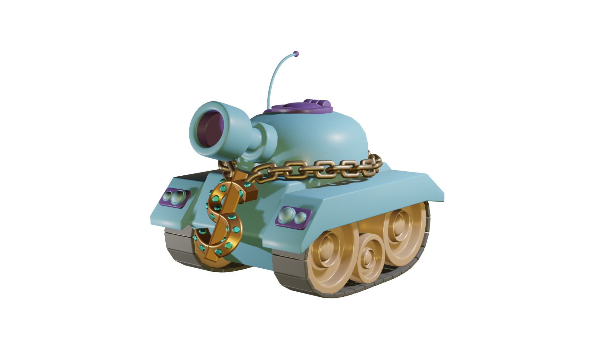
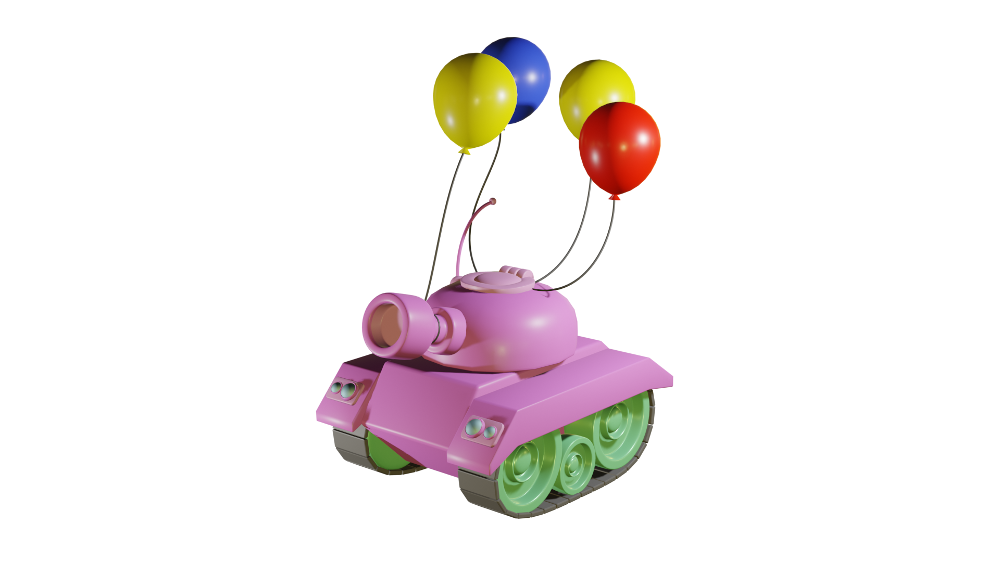
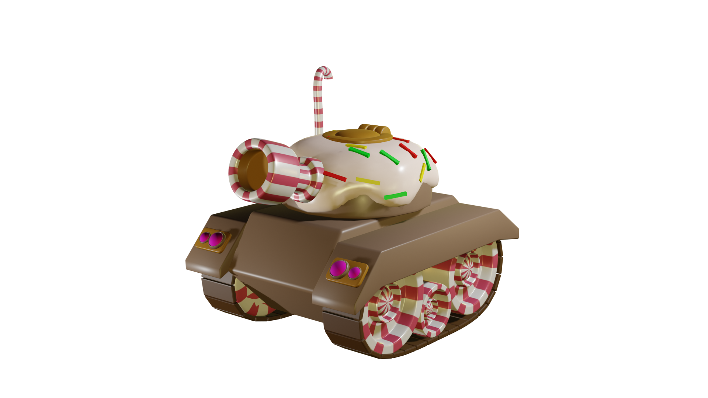
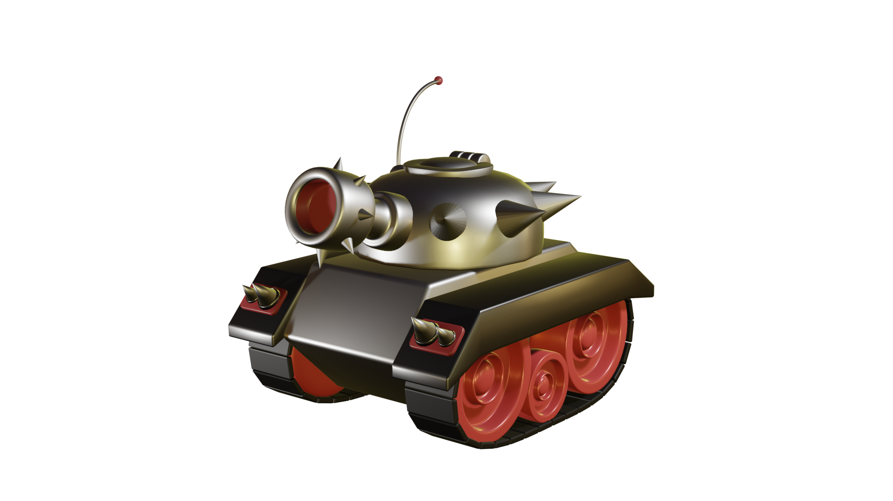
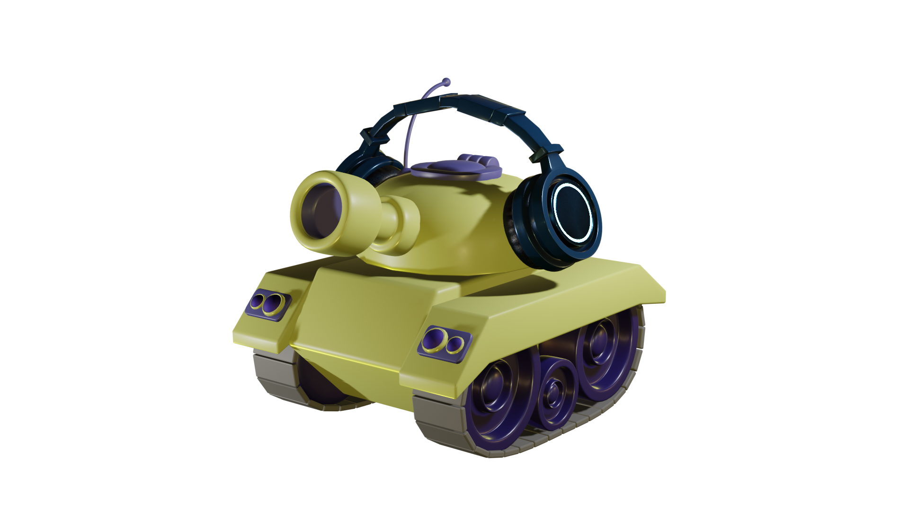
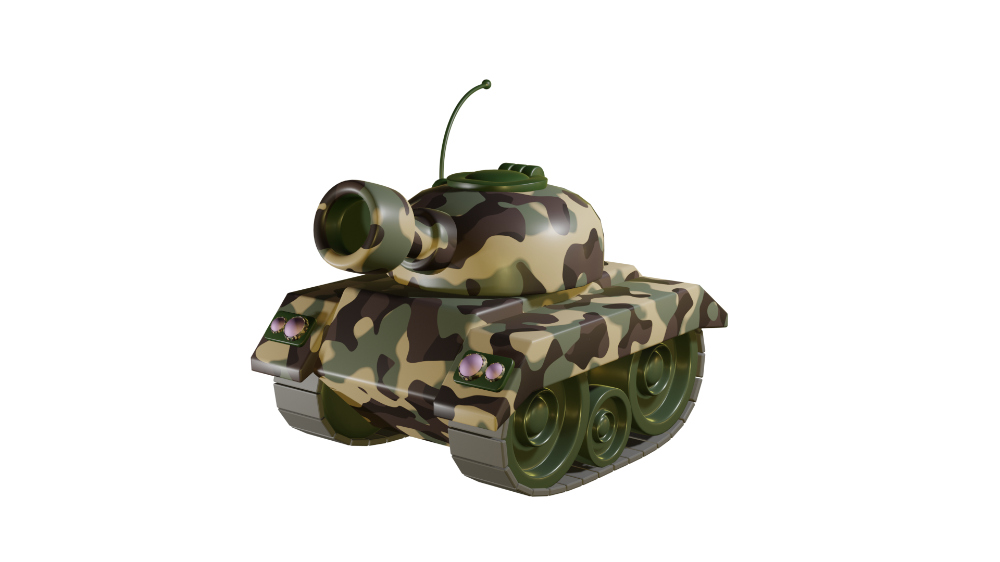

# NFT Tank

## Total supply

NFT TANK total supply 5000, including 2000 in the white list and 3000 in the public mint.

## **Play to earn**

Race your NFT Tank and earn realtime cryptocurrency rewards with our Tank token. You can use these rewards to earn money from playing the game or upgrade your NFT Tank to improve its performance.

## **NFT Upgrades**

Winning a match earns token Tank – This is our rewards in crypto , this allows you to unlock blueprints, build tank, perform upgrads and gain experience/XP levels.

## **Metaverse Linked**

Manage your profile as a player, collector, shopkeeper, or any of the other roles available. Customise your profile and upload it to the metaverse or bring in a profile NFT from your favourite collection!

## **DAOS, Tracks, Leagues**

NFT ownership allows holders to create and join DAOs – create your own clan, design tracks, organise events, tournamtes and more!

<figure><figcaption></figcaption></figure>

<figure><figcaption></figcaption></figure>

<figure><figcaption></figcaption></figure>

<figure><figcaption></figcaption></figure>

<figure><figcaption></figcaption></figure>

<figure><figcaption></figcaption></figure>

