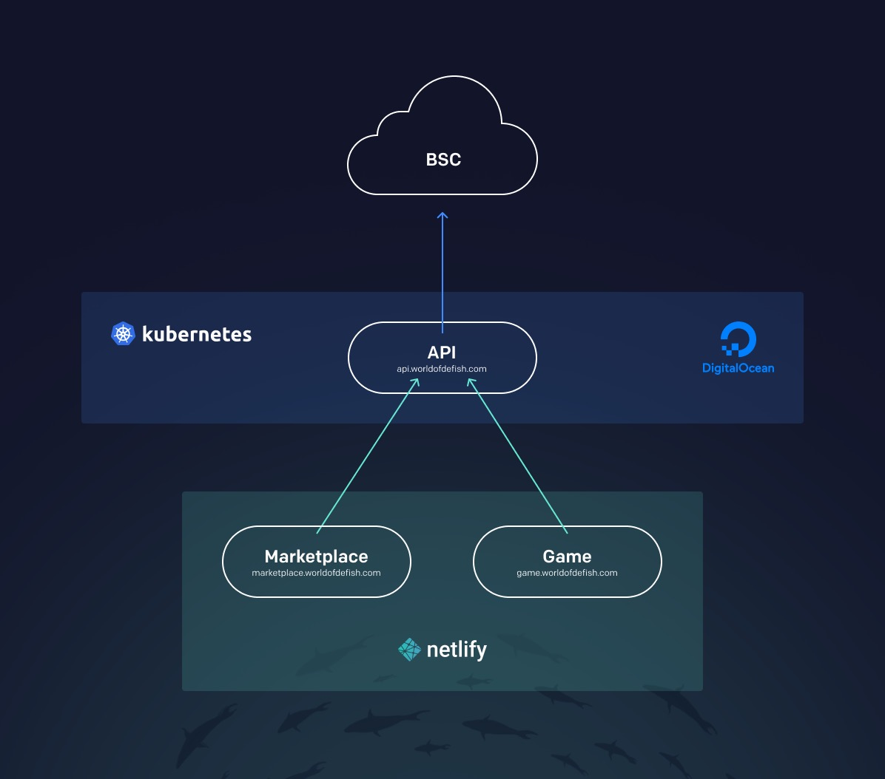
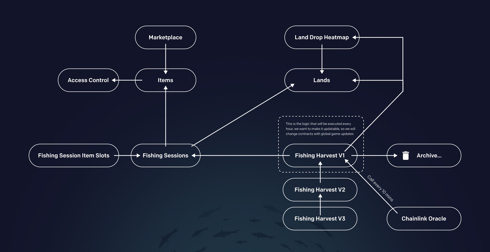

# Technology

## **Infrastructure**

TankWar will runs entirely on the blockchain, as opposed to centralized games running on their own servers. Having all gameplay done on-chain provides a level of trust not commonly found in traditional games, and allows all users to verify the code that runs the game, as well as all interactions happening on the game's smart contracts.

All the requests to the blockchain (except transactions) will go through our API endpoint, to make the gaming experience really responsive. The API will aggregate and format blockchain data.

API consists of a microservices that runs in the Kubernetes cluster. All the front end runs in Netlify CDN. All this in the big picture gives an incredible uptime (99.9%).

<figure><figcaption></figcaption></figure>

As for technologies/frameworks - for API we use Nest.js that has a strong community and a good reputation in the enterprise, for Frontend we use Vue.js with Vuetify, to inherit it’s stunning user experience and development speed.

### **Smart Contracts**

Here you can see contracts dependency and general structure. We have big plans, so we made the structure **** as **** flexible as possible.

<figure><figcaption></figcaption></figure>
